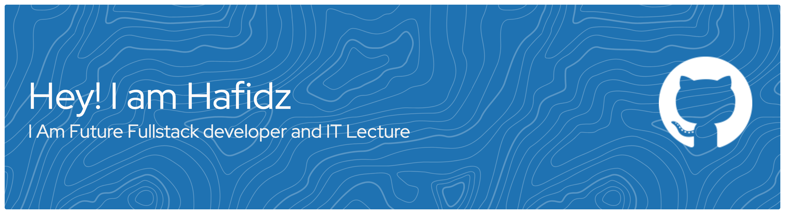

## Hello Word I Am Hafidz 👋

<!--
**hafidzcoy/hafidzcoy** is a ✨ _special_ ✨ repository because its `README.md` (this file) appears on your GitHub profile.

Here are some ideas to get you started:

- 🔭 I’m currently working on ...
- 🌱 I’m currently learning ...
- 👯 I’m looking to collaborate on ...
- 🤔 I’m looking for help with ...
- 💬 Ask me about ...
- 📫 How to reach me: ...
- 😄 Pronouns: ...
- ⚡ Fun fact: ...
-->

- 🔭 I’m currently Studying at STAI Nurud Dhalam Indonesia
- 🌱 I’m currently learning Python and GitHub

##### Skills

##### Connect With Me
!(https://www.instagram.com/watashi_hfd)(https://img.shields.io/badge/Instagram-E4405F?style=for-the-badge&logo=instagram&logoColor=white)

##### Let's Play Game With Me

<picture>
  <source media="(prefers-color-scheme: dark)" srcset="https://raw.githubusercontent.com/hafidzcoy/hafidzcoy/output/pacman-contribution-graph-dark.svg">
  <source media="(prefers-color-scheme: light)" srcset="https://raw.githubusercontent.com/hafidzcoy/hafidzcoy/output/pacman-contribution-graph.svg">
  
</picture>
